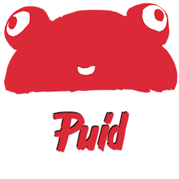

#  Frog Puid

Frog Puid is a Godot plugin that add custom nodes that have a generated persistent ID. This ID is generated while editing scenes and stored in the node.

- Unique across the Godot Project.
- Persistent between multiple load of the game (even when game data changes).

This plugin has been developed by [Frog Collective](http://frog-collective.com).

## Installation

Godot .NET v4.0 or greater is needed to install this plugin. After adding it to your Godot project, you need to successfully build your C# solution before activating it in the plugin tabs of your Project Settings.

Once the plugin is enabled, you will be able to see the custom nodes `PersistentNode2D` and `PersistentNode3D`.

## Usage

 `PersistentNode2D` and `PersistentNode3D` nodes should be use as scene root only. In their own scene they act like template, they will not have any puid assigned. When you use this scene in another scene, a new unique puid will automatically be generated making this instance identifiable across the whole game.

⚠️ Don't forget to add the `[Tool]` attribute if you inherit from a persistent node.

You can open the test scenes `res://tests/test_2d.tscn` and `res://tests/test_3d.tscn` to see how persistent node can be used.

## License

The plugin is licensed under the [MIT license](LICENSE).
